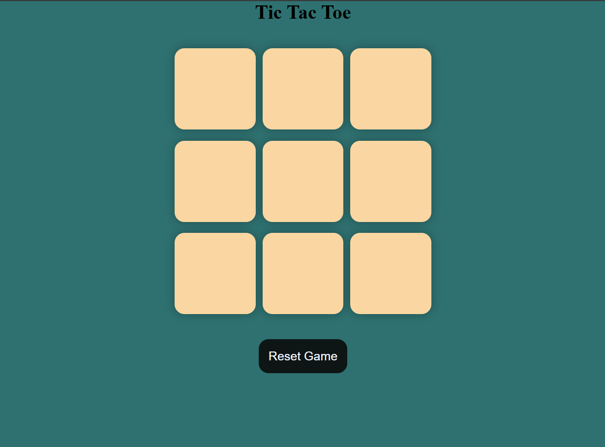

# 🎮 Tic Tac Toe Game

A modern and interactive Tic Tac Toe game built using HTML, CSS, and JavaScript. This project offers a clean user interface, responsive design, and smooth gameplay experience for two players.

## 🚀 Live Demo

🔗 [Play the Game Here](https://tic-tac-toe-code-eight.vercel.app/)

## 📸 Screenshot

## ✨ Features

- Interactive two-player gameplay
- Automatic winner detection
- Draw game detection
- Reset and New Game functionality
- Responsive design for different screen sizes
- Clean and user-friendly interface

## 🛠️ Technologies Used

- HTML5
- CSS3
- JavaScript

## Author

Abiha Nadeem
